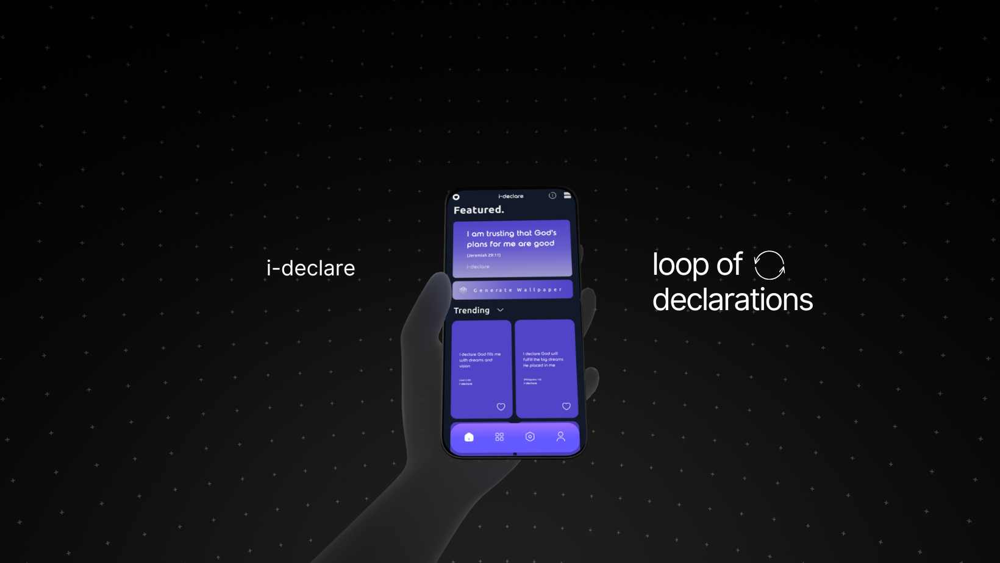

    <a href="https://ideclare-landingpage.vercel.app/"><h1 align="center">ideclare app</h1></a>

 

    
    
    
    

### What is ideclare?
It's a declarations app designed to empower you with a continuous loop of uplifting quotes, helping you transform your weaknesses into strengths.
